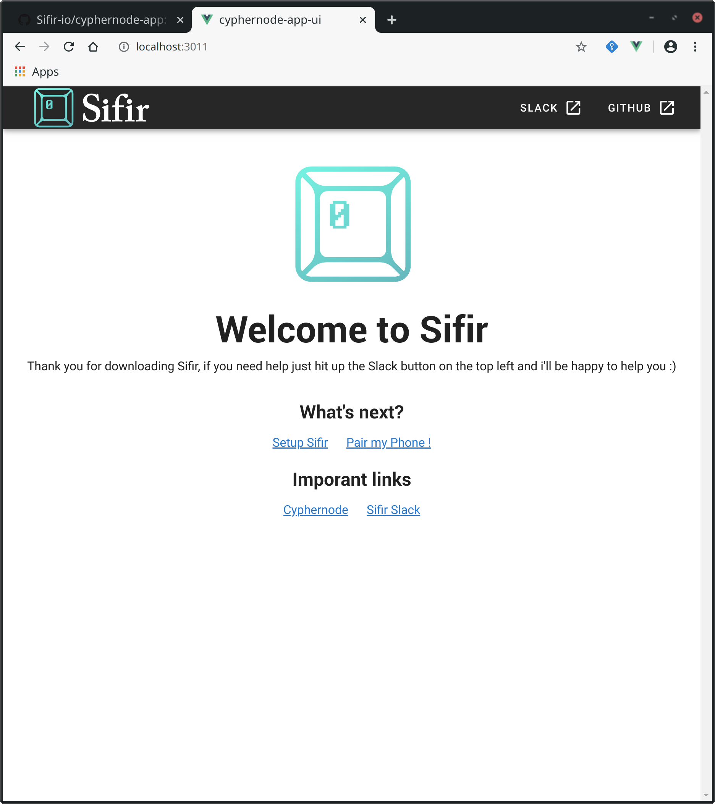
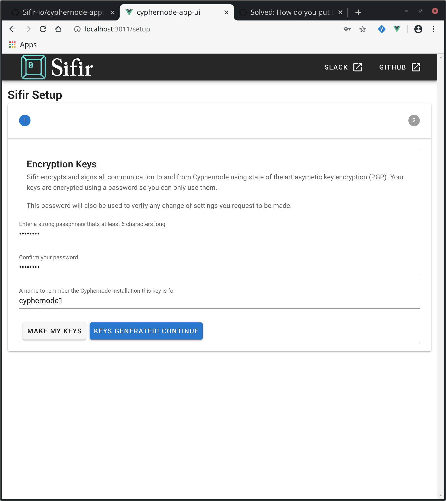
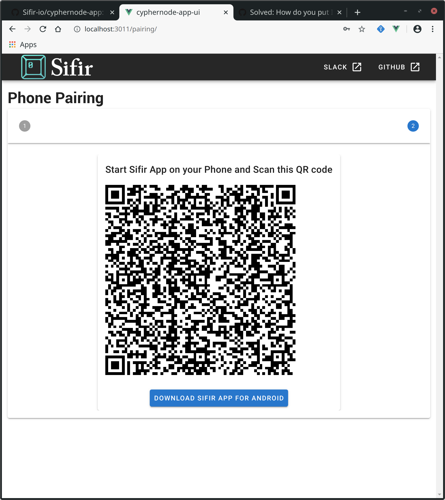

# Sifir - Cypheronde App and UI

Runs as a Cyphernode app to securley bridge communciation between Cyphernode and Sifir mobile wallet.

~~~ WARNING: ALPHA SOFTWARE ~~~
Sifir is very much WIP and is meant for reckless Bitcoin maximalists looking for a badass mobile wallet.

## Requirements
- Docker
- Cyphernode installed: https://github.com/SatoshiPortal/cyphernode
- Sifir Mobile App [LINK TO REPO] / Google play to pair your phone.

## Build and Setup Instructions
1. Run `git clone https://github.com/Sifir-io/cyphernode-app.git`
2. Run `cd <dir> & ./build`
3. edit `docker-compose.yaml` and change the following values to match your Cyphernode installation:
```
      - CYPHERNODE_API_KEY=api key from cyphernode
      - CYPHERNODE_API_KEY_ID=api key id from cyphernode
      - CYPHERNODE_ONION_URL=http://yourCyphernodeOnionUrl.onion
```
4. run `./run.sh ~/cyphernode/dist/cyphernode/certs/cert.pem` replacing `~/cyphernode/dist/cyphernode/certs/cert.pem` with the path to Cyphernode's certifcate. Note: If you have installed Cyphernode under a special user different than the one you login to your system with you might want to the `cert.pem` file from cyphernode's folder to the folder sifir app is installed under and point to it to prevent having to use sudo to access every time you want to run Sifir.

## Pairing phone with mobile wallet

1. Open your browser and head to 'http://localhost:3011'

2. Setup keys for your node.

3. Download Sifir App [MAKE THIS A LINK]
4. Scan the QR code with the Sifir App.

5. Enjoy an ananymous, private and secure Bitcoin wallet!


