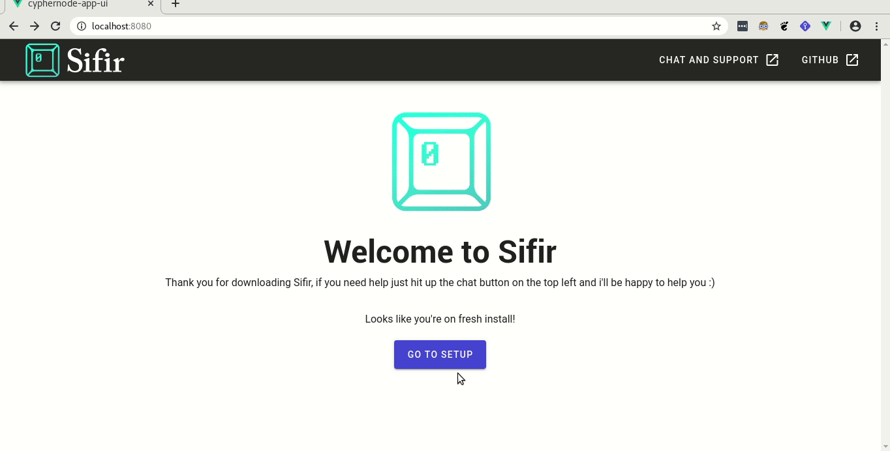

# Sifir Desktop App and UI
Runs as on your computer/pi to securley bridge communciation between your Bitcoin and Lightning nodes (via Cyphernode) and the Sifir mobile app.

## :warning:  WARNING: ALPHA SOFTWARE :warning:
Sifir is very much WIP. 

## Requirements
- Docker
- Cyphernode installed: https://github.com/SatoshiPortal/cyphernode
- [Sifir Bitcoin Mobile Wallet Apk](https://github.com/Sifir-io/sifir-mobile-wallet/releases) OR Google play (Coming soon) to pair your phone.

## Build and Setup Instructions
1. Run: `git clone https://github.com/Sifir-io/cyphernode-app.git`
2. Run `cd cyphernode-app && ./build.sh`
3. Edit `.env` file with your favorite text editor (IE Vim) and change the following values to match your Cyphernode installation:
```
      - CYPHERNODE_API_KEY=api key from cyphernode
      - CYPHERNODE_API_KEY_ID=api key id from cyphernode
      - CYPHERNODE_ONION_URL=http://[cyphernode-traefik-torr-hiddenservice-hostname]:[traefik-hiddenservice-torr-port]
```
### Getting `CYPHERNODE_API_KEY` , `CYPHERNODE_API_KEY_ID`:
All the values you need can be obtained from your Cyphernode configuration file which can be viewed easily by:

1. Login to your Cyphernode welcome portal
2. Click 'Download your Cyphernode configurations, can be used for another Cyphernode deployment' and open the zip file (Enter your config password when prompted)
3. Open `config.json` and look for the following value path in the json
` gatekeeper_keys.gatekeeper_keys` the value would look something like `003=734f3b......b221e8a`, and so: 
    - CYPHERNODE_API_KEY=734f3b......b221e8a (copy paste the entire string after the equality sign)
    - CYPHERNODE_API_KEY_ID=003
### Getting `CYPHERNODE_ONION_URL` (For TOR pairing only)

`CYPHERNODE_ONION_URL`  Needs to contain Traefik hidden service URL *and* the port. In a typical cyphernode installation with Tor service it can easily be obtained by:
1. Your traefik hidden service hostname can be found: <path to installed cyphernode>/dist/.cyphernodeconf/tor/torrc, ex:
`a3209sdlakdoljkljsads.onion`
2. Your traefik hidden service port can found: <path to installed cyphernode>/dist/.cyphernodeconf/tor/traefik/hidden_service/hostname , look for a line that looks like 
```
HiddenServicePort 2768 traefik
HiddenServicePort 2769 traefik
```
First line is your port number, so in this case `2768` and thus
`CYPHERNODE_ONION_URL=http://a3209sdlakdoljkljsads.onion:2768`

### Getting gatekeeper's SSL certifcate
One last step is to give Sifir access to Cyphernode gatekeeper SSL certificate for https communication. The easiest way to do this is:
1. Login to your Cyphernode welcome portal
2. Click 'Download Client API ID's and keys, needed in your client apps' and open the zip file (Enter your config password when prompted)
3. Copy `cacert.pem` to sifir app root directory

Your now ready !

## Running Sifir and Pairing with your phone
1. Run `./run.sh` 
_Note:_ The run script assumes you have placed `cacert.pem` in the same directory, if you have placed it in another path please providde the path to the certificate as a second parameter , ex `./run.sh ./path/to/ssl/cert.pem`

## Sifir setup and Pairing with mobile wallet

1. Open your browser and go to 'http://localhost:3011' you should see Sifir App 
2. If this is a fresh install click 'Go To Setup'
3. Enter a password to encrypt your PGP keys with (PGP keys will be used to sign and encrypt all communication coming in and out of Sifir), re-enter your password in the confirmation box.
4. Click on 'Make Keys'
5. Wait for Keys to generate and click on 'Continue to Pairing'
6. Select the method you would like to pair your phone with 'Tor' or 'Sifir Sync'
8. Enter a *lowercase only* name for this device, and re-enter your password again. Click 'Show pairing QR code'
9. Download Sifir's mobile App and scan the QR code !
10. Enjoy your awesome private and secure Bitcoin Mobile Wallet :) 



